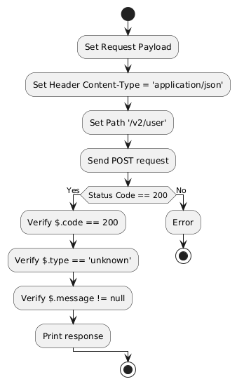

# Servicios API de Swagger Petstore con Karate, Maven y BDD

## Descripción
Este proyecto está diseñado para realizar pruebas de API utilizando Karate Framework con un enfoque en Behavior-Driven Development (BDD). Está configurado con Maven para la gestión de dependencias y la ejecución de pruebas. El objetivo es proporcionar una solución robusta para la automatización de pruebas de servicios RESTful, siguiendo las mejores prácticas en pruebas automatizadas.

## Tecnologías usadas
- **Karate Framework**: Framework para pruebas de API basado en BDD que permite escribir pruebas de manera legible y sencilla. Utiliza Gherkin para definir escenarios y Karate para la ejecución de pruebas.
- **Maven**: Herramienta de automatización de construcción y gestión de dependencias utilizada para compilar el código y ejecutar las pruebas.
- **Java**: Lenguaje de programación en el que están escritas las pruebas y configuraciones del proyecto.
- **BDD (Behavior-Driven Development)**: Enfoque de desarrollo que promueve la colaboración entre desarrolladores, QA y otros stakeholders mediante la definición de comportamientos en un lenguaje comprensible.
- **JUnit 5**: Framework para ejecutar pruebas unitarias y de integración en Java.

## Estructura del proyecto

- **src/test/java**: Contiene los archivos Java para la configuración de pruebas y los ejecutores.
  - **TestRunner.java**: Clase para ejecutar las pruebas Karate utilizando JUnit 5.
- **src/test/resources**: Carpeta para recursos y configuraciones de Karate.
  - **karate-config.js**: Archivo de configuración de Karate para manejar diferentes entornos y configuraciones globales.
- **features/**: Carpeta que contiene los archivos de características en formato Gherkin para las pruebas BDD.
  - **FindUpdatedUser.feature**: Pruebas para encontrar un usuario actualizado.
  - **FindUser.feature**: Pruebas para encontrar un usuario creado.
  - **UpdateNameMailUser.feature**: Pruebas para actualizar el nombre y el correo electrónico de un usuario.
- **payload/**: Carpeta que contiene los payloads de solicitud para las pruebas de API.
  - **CreateUserPayload.json**: Payload para la creación de un usuario.
  - **UpdateUserPayload.json**: Payload para la actualización de un usuario.

## Configuración

1. **Instalación de dependencias de Maven**:
   - Asegúrate de tener [Maven](https://maven.apache.org) instalado.
   - Ejecuta `mvn clean install` para instalar todas las dependencias del proyecto y compilar el código.

2. **Ejecutar pruebas de Karate**:
   - Las pruebas de Karate se ejecutan desde la clase `TestRunner.java` utilizando JUnit 5.
   - Para ejecutar todas las pruebas desde la línea de comandos, usa el siguiente comando:
     ```bash
     mvn test
     ```

3. **Configuración de Karate**:
   - Edita `src/test/resources/karate-config.js` para personalizar la configuración según el entorno (por ejemplo, dev, staging, prod).

## Ejemplos de uso

- **Ejecutar pruebas de Karate con Maven**:
  - Para ejecutar todas las pruebas de Karate, ejecuta:
    ```bash
    mvn test
    ```

- **Ejecutar pruebas específicas**:
  - Para ejecutar pruebas específicas, asegúrate de que el nombre de la clase de prueba contenga `TestRunner` y ejecute:
    ```bash
    mvn test -Dtest=TestRunner
    ```

## Diagramas de flujo

- **CreateUser.feature | Creación de un usuario**

    

- **DeleteUser.feature | Eliminación de un usuario**

    

- **FindUpdatedUser.feature | Consultar el usuario actualizado**

    

- **FindUser.feature | Buscar el usuario creado**

    

- **UpdateNameMailUser.feature | Actualizar el nombre de usuario y correo**

    

## Licencia
Este proyecto es de código libre. Siéntete libre de usar, modificar y distribuir este código según tus necesidades.
